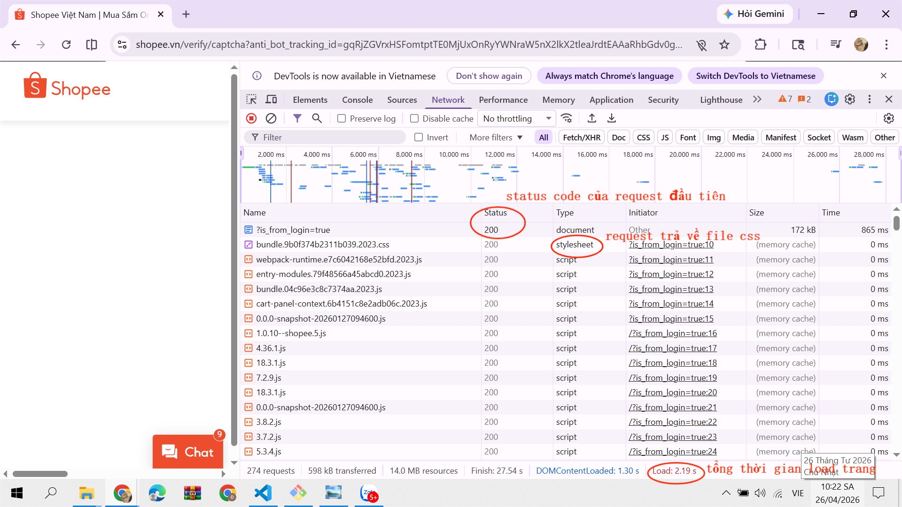

# PHẦN A
## Câu A1:
1. Các bước xảy ra khi gõ https://shopee.vn vào trình duyệt và nhấn Enter
    - Bước 1: Request của mình xuất phát từ laptop -> đi qua router wifi nhà mình
    - Bước 2: Qua nhà mạng VNPT -> chạy xuyên cáp quang dưới đáy Thái Bình Dương
    - Bước 3: Đến data center của Shopee
    - Bước 4: Sever xử lý:"Tôi muốn xem trang chủ"
    - Bước 5: Reponse chạy ngược lại: cáp quang -> VNPT -> router -> laptop
    - Bước 6: Chrome nhận file HTML, CSS, JS -> render ra giao diện -> Mình thấy trang chủ 
* Nguồn tham chiếu: CCC_Frontend_2026/tuan_1_html5/01_introduction_html_universe.md - 🎬 Cuộc Hành Trình 0.3 Giây Xuyên Đại Dương

2. Tab network của shopee trả về:
    - Danh sách tất cả các request (HTML, CSS, JS, ảnh,...)
    - Status code (200-success, 204-no content, 302-redirection,...)
    - Thời gian load từng request
    - Tổng thời gian load trang
    - Loại tài nguyên (document, stylesheet, script,...)
* Ảnh minh họa: 

## Câu A2:
1. Trang web sử dụng quá nhiều thẻ `<div>` không mang ý nghĩa khiến công cụ tìm kiếm như Google khó hiểu cấu trúc trang (header, menu, nội dung chính, footer,..) nên bị đánh giá SEO 
2. 4 lỗi semantic:
    - Sử dụng thẻ `<div>` thay vì thẻ semantic
    - Menu không dùng `<nav>`,...
    - Không có heading (`<h1>`, `<h2>`,...)
    - Không dùng `<section>`, `<main>`,... -> nội dung không được phân vùng rõ ràng
    - Thiếu thuộc  alt cho hình ảnh

**Code sửa lại**
```html
<header>
    <h1 class="logo"><a href="/">ShopTLU</a></h1>
    <nav>
        <ul>
            <li><a href="/">Trang chủ</a></li>
            <li><a href="/products">Sản phẩm</a></li>
        </ul>
    </nav>
</header>

<main>
    <article class="product">
        <h2>iPhone 16 Pro</h2>
        <p class="price">25.990.000đ</p>
        <figure class="image">
            
        </figure>
    </article>
</main>

<footer>
    <p>© 2026 ShopTLU</p>
</footer>
```

* Nguồn tham chiếu: CCC_Frontend_2026/tuan_1_html5/04_visible_part_html.md

## Câu A3:
_________________________________
|            Hộp 1              | -> block chiếm cả dòng
_________________________________
Text A Text B                     -> nằm cạnh nhau, chung hàng
_________________________________
|            Hộp 2              | -> xuống dòng mới
_________________________________
Text C **Text D**                 -> nằm cạnh nhau, chung hàng
_________________________________
|            Hộp 3              | -> xuống dòng mới và chiếm cả dòng


* Giải thích chi tiết:
    - Dòng 1, 3, 5: Hiển thị dưới dạng một khối riêng biệt, chiếm toàn bộ chiều ngang của trình duyệt. Điều này là do thẻ `<div>` là phần tử block, nó luôn bắt đầu trên một dòng mới và chiếm hết chiều rộng khả dụng.
    - Dòng 2, 4: Hiển thị trên cùng một dòng. Điều này là do thẻ `<span>`, `<strong>` đều là phần tử inline, không tạo dòng mới chỉ chiếm đúng phần nội dung nên chúng nằm cạnh nhau mà không xuống dòng.

* Nguồn tham chiếu: CCC_Frontend_2026/tuan_1_html5/04_visible_part_html.md - 📊 Block vs Inline — Hai loại element cơ bản

## Câu A4:
* Sự khác nhau giữa các thẻ
    - `<thead>`: Phần đầu bảng, chứa tiêu đề các cột.
    - `<tbody>`: Phần thân bảng, chứa nội dung, dữ liệu chính của bảng.
    - `<tfoot>`: Phần chân bảng, dùng để tổng kết hoặc ghi chú.

* Lý do không dùng table để tạo layout trang web
    - Table chỉ dùng để hiển thị dữ liệu bảng (Tabular Data)
    - Bảng khó tùy chỉnh co giãn trên điện thoại
    - Cấu trúc lồng nhau (table > tr > td > table...) rắc rối, phức tạp và khó bảo trì

* Nguồn tham chiếu: CCC_Frontend_2026/tuan_1_html5/05_tables_hyperlinks.md - 📊 Table — Bảng dữ liệu

# PHẦN B
## Bài B3:
**Các lỗi trong đoạn mã gốc**
1. Lỗi dòng 1: thiếu khai báo tài liệu `html` trong thẻ DOCTYPE -> `<!DOCTYPE html>`
2. Lỗi dòng 2: Thẻ `<html>` thiếu thuộc tính ngôn ngữ -> `<html lang="vi">`
3. Lỗi dòng 4: thẻ `<title>`chưa đóng -> `<title>Trang web</title>`
4. Lỗi dòng 5: giá trị charset sai chuẩn -> `<meta charset="UTF-8">`
5. Lỗi dòng 8: Thẻ `<h1>` đóng bằng thẻ mở -> `</h1>`
6. Lỗi dòng 12: Thẻ `<a>` đóng sai bằng thẻ mở -> `</a>`
7. Lỗi dòng 20: Thẻ `` thiếu dấu ngoặc kép cho đường dẫn và thiếu thuộc tính alt -> ``
8. Lỗi dòng 22: Sai thứ tự đóng thẻ lồng nhau -> `<p>Giá: <b>25.990.000đ</b></p>`
9. Lỗi bảng: thiếu cấu trúc semantic (thead, tbody) và header table dùng `<td>` -> dùng `<th>` cho tiêu đề và bọc trong `<thead>`
10. Lỗi dòng 40, 42: Dùng 2 thẻ `<main>` trong một trang -> `<aside>`
11. Lỗi dòng 45: Thẻ `<p>` chưa đóng -> `<p>Copyright 2026</p>`
12. Lỗi dòng 12, 13: Sai định dạn đường dẫn -> `<a href="home.html">Trang chủ</a>, <a href="products.html">Sản phẩm</a>`

## Bài B4
### 1. Phân tích thẻ Semantic 
* 3 thẻ semantic dùng đúng
    - Thẻ `<header>`: Nằm trong thẻ `<body>`. Thẻ này chứa toàn bộ thanh công cụ phía trên như logo, ô tìm kiếm và các danh 
    - Thẻ `<footer>`: Nằm ở phía cuối trang. Thẻ này chứa các thông tin về bản quyền, liên hệ và các liên kết chính sách
    - Thẻ `<section>`: Nằm bên trong thẻ `<footer>`. Thẻ này dùng để phân chia nhóm nội dung lớn trong phần chân trang
* 2 thẻ không dùng đúng semantic
    - Thẻ `<div>`: dùng quá nhiều cho các khối nội dung 
    - Thẻ `<p id="gb-top-page">`: thẻ này chứa nút cuộn lên. Theo đúng semantic, đây là một hành động tương tác, nên dùng thẻ `<button>` hoặc thẻ `<a>`

* Nguồn tham chiếu: CCC_Frontend_2026/tuan_1_html5/04_visible_part_html.md - 🏗️ Semantic HTML5 — "Thẻ có ý nghĩa"

### 2. Thẻ `<table>`
* Nội dung bảng: hiển thị thông số kỹ thuật chi tiết của Samsung Galaxy S26 Ultra (màn hình, vi xử lý, camera sau,...)
* Thẻ `<table>` này không dùng `<thead>` hay `<tbody>` mà được viết theo phong cách inline

* Nguồn tham chiếu: CCC_Frontend_2026/tuan_1_html5/05_tables_hyperlinks.md

### 3. Phân tích form
* Action của form: 
    - action="/tim-kiem"
    - Khi người dùng bấm vào nút tìm kiếm, dữ liệu sẽ được gửi về đường dẫn /tim-kiem trên hệ thống để xử lý và trả về kết 
* Các input types được sử dụng
    - type="text"
    - type="submit"

* Nguồn tham chiếu: CCC_Frontend_2026/tuan_1_html5/07_forms_interactive.md

# PHẦN C
## Bài C1
```html
<!DOCTYPE html>
<html lang="vi">
<head>
    <meta charset="UTF-8">
    <title>Chi tiết sản phẩm</title> <!-- title để định danh trang -->
</head>
<body>
    <header> <!-- phần đầu trang -->
        <h1>Logo / Tên website</h1> <!-- tiêu đề chính của website -->
        <nav> <!-- điều hướng chính -->
            <ul> <!-- danh sách menu -->
                <li><a href="#">Trang chủ</a></li>
                <li><a href="#">Danh mục</a></li>
                <li><a href="#">Liên hệ</a></li>
            </ul>
        </nav>
    </header>
    <nav aria-label="breadcrumb"> <!-- nav cho breadcrumb -->
        <ol> <!-- ol vì có thứ tự phân cấp -->
            <li><a href="#">Trang chủ</a></li>
            <li><a href="#">Điện thoại</a></li>
            <li>iPhone 16</li>
        </ol>
    </nav>
    <main> <!-- nội dung chính -->
        <section class="product-detail"> <!-- nhóm chi tiết sản phẩm -->
            <section class="product-gallery">
                <h2>Hình ảnh sản phẩm</h2> <!-- thêm heading để hợp lệ semantic -->
                <figure> <!-- mỗi ảnh là 1 media -->
                    
                </figure>
                <figure>
                    
                </figure>
                <figure>
                    
                </figure>
                <figure>
                    
                </figure>
                <figure>
                    
                </figure>
            </section>
            <article class="product-info"> <!-- nội dung sản phẩm độc lập -->
                <h2>Tên sản phẩm</h2>
                <p class="price">Giá sản phẩm</p>
                <p class="rating">
                    <span>★★★★★</span>
                    <span>(100 đánh giá)</span>
                </p>
                <section class="description"> <!-- mô tả -->
                    <h3>Mô tả</h3>
                    <p>Thông tin mô tả sản phẩm...</p>
                </section>
            </article>
        </section>
        <section class="specifications"> <!-- bảng thông số -->
            <h2>Thông số kỹ thuật</h2>
            <table border="1">
                <thead>
                    <tr>
                        <th>Thuộc tính</th>
                        <th>Giá trị</th>
                    </tr>
                </thead>
                <tbody>
                    <tr>
                        <td>Màn hình</td>
                        <td>6.1 inch</td>
                    </tr>
                    <tr>
                        <td>CPU</td>
                        <td>A18</td>
                    </tr>
                </tbody>
            </table>
        </section>
        <section class="reviews"> <!-- đánh giá -->
            <h2>Đánh giá</h2>
            <article class="review">
                <h3>Tên người dùng</h3>
                <p>Nội dung bình luận...</p>
            </article>
            <article class="review">
                <h3>Tên người dùng</h3>
                <p>Nội dung bình luận...</p>
            </article>
        </section>
    </main>
    <aside> <!-- sidebar -->
        <h2>Sản phẩm tương tự</h2>
        <ul>
            <li><a href="#">Sản phẩm 1</a></li>
            <li><a href="#">Sản phẩm 2</a></li>
            <li><a href="#">Sản phẩm 3</a></li>
        </ul>
    </aside>
    <footer> <!-- footer -->
        <p>&copy; 2026 Website bán hàng</p>
    </footer>
</body>
</html>
```
## Bài C2
Dùng `<div>` cho mọi thứ rồi thêm class có thể nhanh lúc đầu, nhưng về lâu dài là một cách làm thiếu bền vững. **Thứ nhất**, về SEO, các công cụ tìm kiếm như Google không chỉ đọc nội dung mà còn dựa vào cấu trúc HTML để hiểu trang. Khi sử dụng các thẻ semantic như `<header>, <main>, <article>`,...nội dung sẽ được phân loại rõ ràng hơn, giúp cải thiện khả năng index và xếp hạng. Nếu tất cả đều là `<div>`, bot sẽ phải đoán cấu trúc đẫn đến giảm hiệu quả SEO.
**Thứ hai**, về accessibility(khả năng truy cập), các công cụ hỗ trợ như ccreen teader dựa vào semantic HTML để giúp người khiếm thị điều hướng trang. Ví dụ, họ có thể nhảy nhanh giữa các nav, ,main hoặc section. Nếu chỉ dùng `<div>`, trải nghiệm này gần như bị phá vỡ vì không còn ý nghĩa ngữ cảnh.
**Ví dụ thực tế**: trong một trang tin tức, nếu dùng `<article>` cho mỗi bài viết, screen render có thể nhảy nhanh giữa các bài. Còn nếu dùng `<div>`, người dùng phải nghe toàn bộ nội dung mới hiểu được.
**Tuy nhiên**, không phải lúc nào `<div>` cũng sai. Trong những trường hợp chỉ cần chia layout hoặc nhóm phần tử để CSS/JS xử lý, mà không có ý nghĩa nội dung cụ thể, thì dùng `<div>` là hợp lý. Ví dụ như một container để chia cột bằng Flexbox.
Tóm lại, semantic HTML sẽ giúp code dễ hiểu hơn, tốt cho SEO và thân thiện với người 
# PHẦN D
* link video: https://drive.google.com/file/d/1E_cE-qH5O-KHwRo-EGntyEf_sPOojgsH/view?usp=sharing